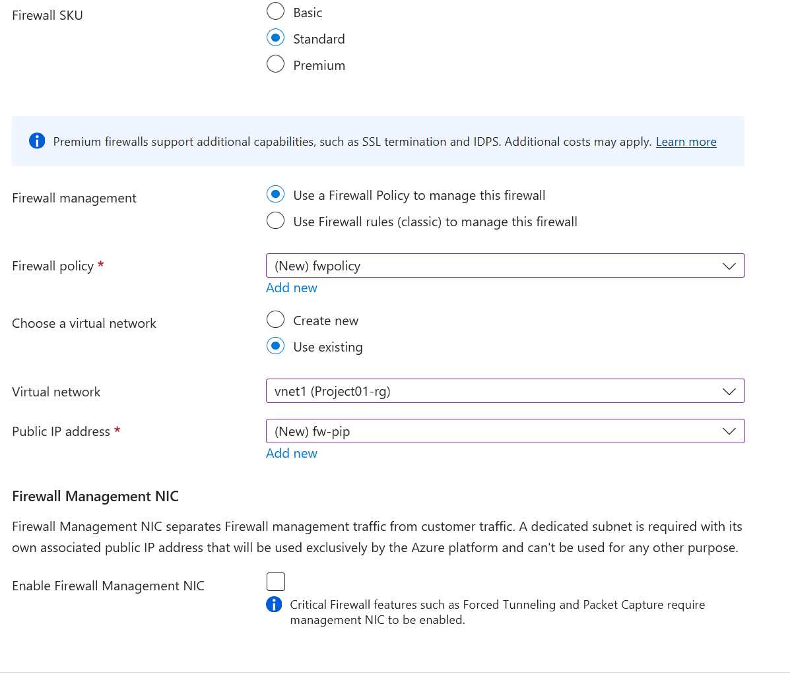

## Virtual Network & Security Lab

## Objective
Build a secure, segmented Azure network with multiple VNets, subnets, and firewall rules.

## Tasks
1. Create multiple VNets and subnets.
2. Configure Network Security Groups (NSGs) with inbound/outbound rules.
3. Set up Azure Firewall.
4. Enable VNet Peering.

## Skills Covered
- Azure Networking
- Security
- Firewall Rules
- VNet Peering

## Scripts
- `scripts/setup-vnet.ps1` → PowerShell script to create VNets and NSGs

## Steps Completed
1. Create resource group 'project01-rg'
2. Create vnets
   - 'vnet1' with address space '10.0.0.0' and /24 subnet.
   - 'vnet2' with address space '10.1.0.0' and /24 subnet.
3. Create NSG 'vnet1-nsg' and associate with vnet1 subnet
    - Create inbound nsg rule called allow_rdp
    - port 3389 and priority 1000
4. Create NSG 'vnet2-nsg' and associate with vnet2 subnet

### Create Firewall
5. Create subnet called 'azurefirewallsubnet' in vnet1 and vnet 2
6. Create firewall named 'vnet01-fw' with standard sku.
    - create new standard firewall policy named 'fwpolicy' 
    - uncheck 'enable firewall management nic'
    - Selected 'use existing' virtual network 
    - Created a public ip 'fw-pip'
    

### Create Firewall Rules
7. Navigate to 'Azure firewall policies' and open policy named 'fwpolicy'
8. create a network rule collection as below

    - Name: Allow-internet-to-VM's
    Rule type: Network
    Priority: 500
    Collection group: DefaultNetworkRuleCollectionGroup

    - Name: Allow-RDP
    Source: IP Address
    Source: 0.0.0.0/0
    Protocol: TCP
    Dest Ports: 3389 
    Dest Type: IP Address
    Dest: 10.0.0.0/24,10.1.0.0/24

    - Name: Allow-internet
    Source: IP Address
    Source: 0.0.0.0/0
    Protocol: TCP
    Dest Ports: 80
    Dest Type: IP Address
    Dest: 10.0.0.0/24,10.1.0.0/24

9. create a NAT rule collection as below 

    - Name: Allow-internet-to-VM's
    Rule type: Network
    Priority: 150
    Collection group: DefaultDNATRuleCollectionGroup

    - Name: Allow-RDP
    Source: IP Address
    Source: 0.0.0.0
    Protocol: TCP
    Dest Ports: 3389 
    Dest Type: IP Address
    Dest: 10.0.0.0/24,10.1.0.0/24

### Creating Vnet peering
10. select **peering** from vnet1 
   - **Remote peering**: link name `vnet2-spoke`, allow forwarding for `vnet2`
   - **Local peering**: link name `vnet1-hub`, allow forwarding for `vnet1`

   ## Design Decisions
- Azure Firewall was used to centralize traffic filtering across VNets.
- RBAC roles were assigned at the resource group level to follow least-privilege principles.
- VMs were deployed without public IPs to reduce attack surface.

