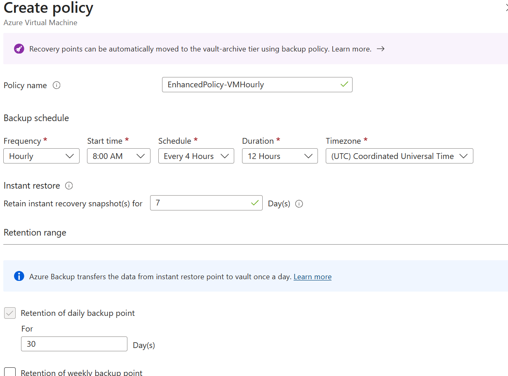
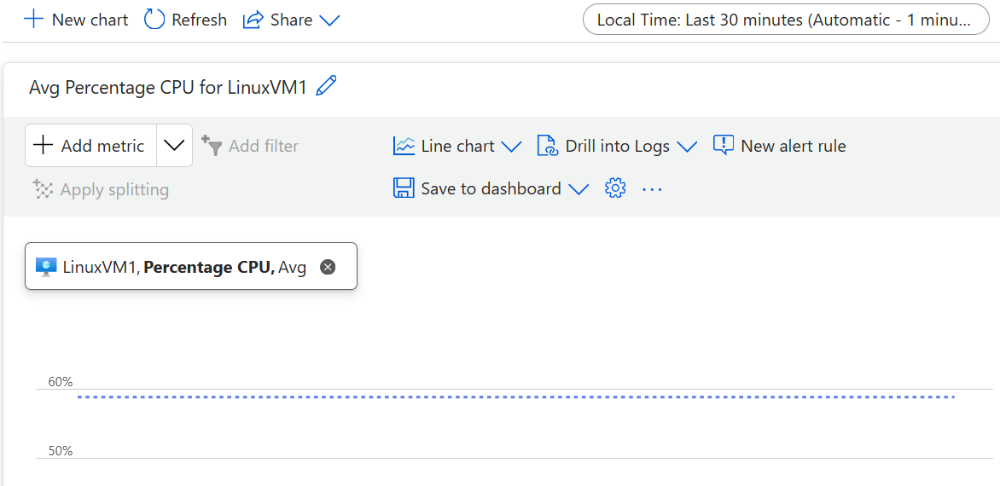

# VM Deployment & Management Lab

## Objective
Deploy and manage Windows and Linux virtual machines in Azure, including
scaling, backup, monitoring, and basic connectivity testing.

## Tasks
1. Deploy VMs via Azure Portal and PowerShell.
2. Configure a Virtual Machine Scale Set.
3. Enable VM backups and monitoring.
4. Test VM connectivity and performance.

## Skills Covered
- VM Lifecycle Management
- Automation
- Monitoring and Backup
- Cost-Aware Design

## Scripts
- `scripts/deploy-vms.ps1` → PowerShell script to deploy and configure VMs

## Steps Completed

1. Created resource group `project02-rg`.
2. Created virtual network `vnet1` with address space `10.0.0.0/24` and subnet `Subnet1`.
3. Created NSG `vnet1-nsg` and associated it with `Subnet1`.

### Virtual Machine Deployment

4. Deployed Windows virtual machine:
   - Name: `WinVM1`
   - Region: UK South
   - Image: Windows Server x64
   - Size: `Standard_B1s`
   - Public IP with RDP (3389) enabled
   - Standard SSD
   - Managed boot diagnostics enabled
   - Administrator username and password configured

5. Deployed Linux virtual machine:
   - Name: `LinuxVM1`
   - Image: Ubuntu Server 24.04 LTS
   - Size: `Standard_B1s`
   - Public IP with SSH (22) enabled
   - Standard SSD
   - Managed boot diagnostics enabled
   - SSH key pair created and private key downloaded securely

> Note: Resources were deployed using development-sized SKUs to minimize cost,
while following production design principles.

### Virtual Machine Scale Set

6. Created Virtual Machine Scale Set `VMSS1`:
   - Region: UK South
   - Availability zone: 3
   - Orchestration mode: Flexible
   - Scaling mode: Manual
   - Instance count: 2
   - Image: Windows Server x64
   - Size: `Standard_B1s`
   - Network: `vnet1 / Subnet1`
   - Patch orchestration: Automatic by platform

### Backup Configuration

7. Enabled Azure Backup for `WinVM1`:
   - Created Recovery Services Vault
   - Selected Enhanced policy
   - Custom policy name: `EnhancedPolicy-VMHourly`
   - Left remaining settings as default
   

### Connectivity & Performance Testing

8. Verified connectivity by successfully connecting to `LinuxVM1` via SSH using
the generated key pair.

9. Reviewed performance metrics in Azure Monitor:
   - Scope: `LinuxVM1`
   - Metric namespace: Virtual Machine Host
   - Metric: CPU Percentage
   