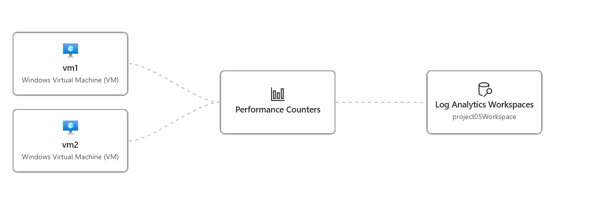
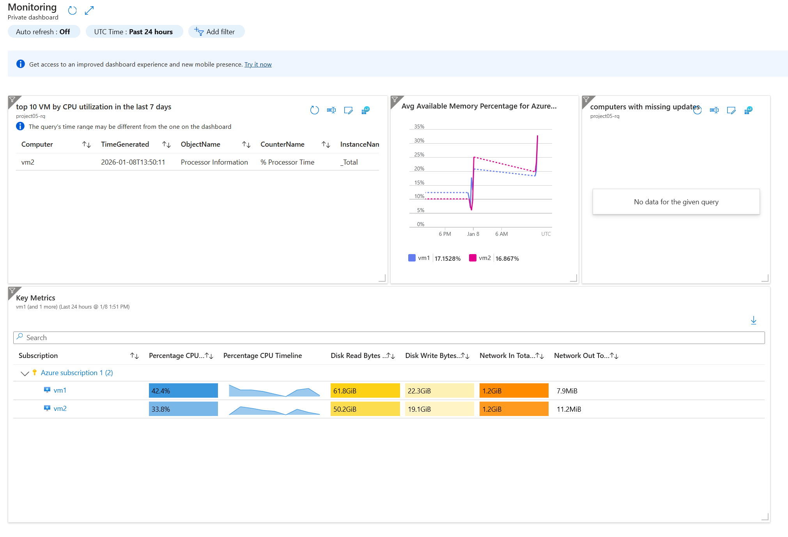

# Monitoring & Incident Simulation Lab

## Objective
Implement monitoring solutions and simulate incidents in Azure.

## Tasks
1. Configure Azure Monitor and Log Analytics.
2. Set up alerts and dashboards.
3. Simulate incidents and respond appropriately.

## Skills Covered
- Observability
- Incident Response
- Monitoring

## Scripts

### Resources Needed
- Resource Group
- Virtual Network (VNet) and Subnets
- Virtual Machines (VMs)
- Recovery Services Vault
- Log Analytics Workspace
- Azure Monitor

## Steps Completed
4. Created following resources
- Resource group: project05-rg
- Virtual Network: VNET1 / Subnet: Subnet1
- Virtual Machine VM1, VM2
> Used deploy function from VM1 to create VM2.

5. Create log analytics workspace
```cli
az monitor log-analytics workspace create \
--resource-group project05-rg \
--workspace-name project05_Workspace
```
6. Create DCR and associated VMs
- Name DCR1
- Date Sources: Performance Counters. CPU,Memory,Disks,Network
- Destitation: project05_Workspace
- Resources: VM1, VM2


7. Create monitoring action group
```cli
az monitor action-group create \
--name ActionGroup1 \
--resource-group project05-rg \
--short-name AG1 
--action email admin "admin@test.com"
```

8. Create monitoring alert rules
```cli
az monitor metrics alert create \
  --name HighCPUAlert \
  --resource-group project05-rg \
  --scopes /subscriptions/<sub-id>/resourceGroups/<RG>/providers/Microsoft.Compute/virtualMachines/<VM-name> \
  --condition "Percentage CPU > 80" \
  --description "Alert when CPU exceeds 80%" \
  --action-group MyActionGroup
  ```

  9. Create dashboard
  a. Use Azure Portal
    Go to Azure Portal.
    Navigate to Dashboard.
    Click + New dashboard.
    Add tiles: metrics, logs, resource health, etc.
    Save and share.



