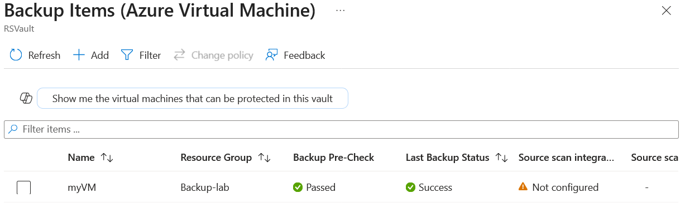
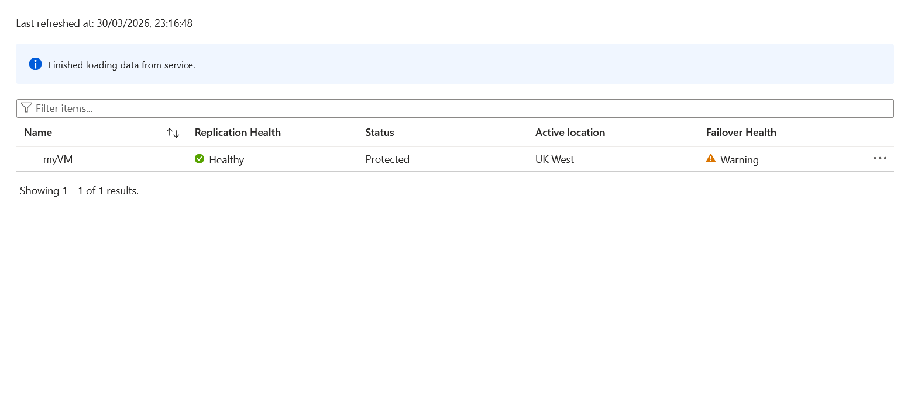
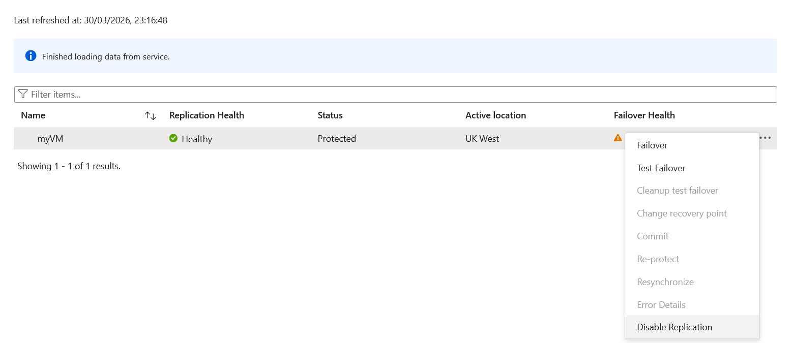
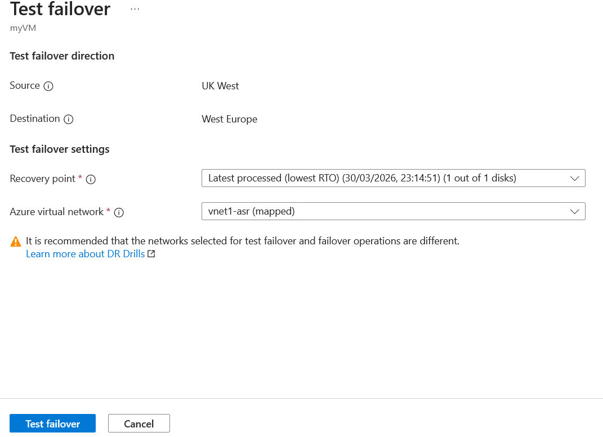
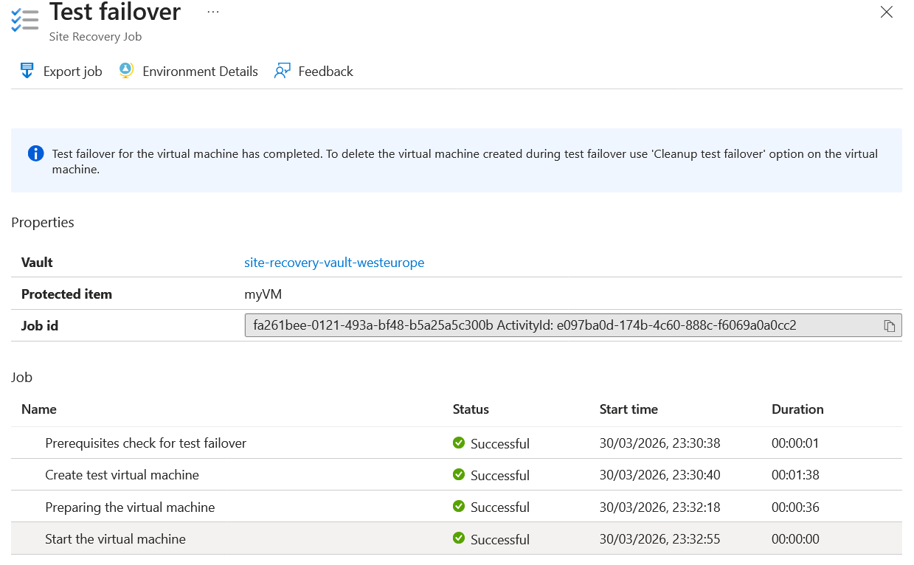
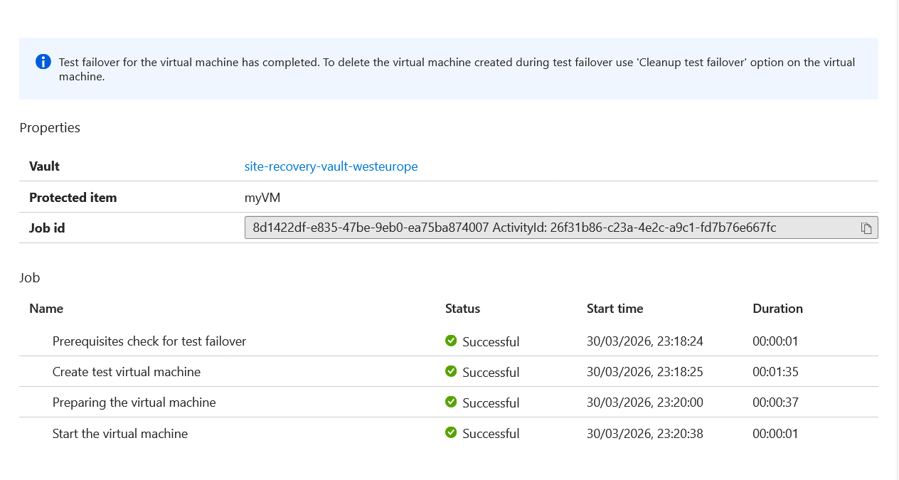

# Backup & Disaster Recovery Lab

## Objective
Implement Azure Backup and Site Recovery for business continuity.

## Tasks
1. Configure Azure Backup for VMs and storage.
2. Set up Azure Site Recovery for failover.
3. Test failover and recovery scenarios.

## Skills Covered
- Backup and Recovery
- Disaster Recovery Planning
- Replication

## Architecture
- Source region: ukwest (VM, Backup Vault)
- Target region: uksouth (ASR Vault, failover target)

## Errors Encountered & Fixes
 - ASR PowerShell context issues → completed via portal instead

## Scripts
- `scripts/backup-setup.ps1` → PowerShell script to configure backups and DR

### Create resource group
new-azResourceGroup -Name backup-lab -Location ukwest  
$rg = "backup-lab"

### Create VNet
$vnet = new-azvirtualNetwork -ResourceGroupName backup-lab -Location ukwest -Name vnet1 -AddressPrefix 10.0.0.0/16 `
$subnet = Add-AzVirtualNetworkSubnetConfig -AddressPrefix 10.0.0.0/24  -Name Subnet1 -VirtualNetwork $vnet `       
Set-AzVirtualNetwork -VirtualNetwork $subnet

### Create VMs
New-AzVm `
    -ResourceGroupName 'Backup-lab' `
    -Name 'myVM' `
    -Location 'ukwest' `
    -Image 'MicrosoftWindowsServer:WindowsServer:2022-datacenter-azure-edition:latest' `
    -VirtualNetworkName 'vnet1' `
    -SubnetName 'subnet1' `
    -SecurityGroupName 'myNetworkSecurityGroup' `
    -OpenPorts 80,3389

## ----- Backup & Recovery

New-AzRecoveryServicesVault -Name RSVault -ResourceGroupName $rg -Location ukwest 

### Set Vault Context
 Get-AzRecoveryServicesVault -Name "RSVault" | Set-AzRecoveryServicesVaultContext

#### Get Backup policy
 $policy = Get-AzRecoveryServicesBackupProtectionPolicy -Name "DefaultPolicy"

#### Enable protection and apply the policy
 Enable-AzRecoveryServicesBackupProtection -ResourceGroupName "backup-lab" -Name $vmname -Policy $policy

#### Find the container 
 $container = get-azrecoveryservicesbackupcontainer -containertype "AzureVM" -friendlyName $vmName

#### Get backup item
$item = Get-AzRecoveryServicesBackupItem  -Container $container -WorkloadType "AzureVM"

### Backup item & monitor job
 Backup-AzRecoveryServicesBackupItem -Item $item
 Get-AzRecoveryServicesBackupJob -Status InProgress

# ---
### Create recovery service vault in destination region
$asrVault = Get-AzRecoveryServicesVault `
    -Name "RSVault-ASR" `
    -ResourceGroupName "backup-lab"
 New-AzRecoveryServicesVault -Name RSVault-ASR -ResourceGroupName backup-lab -Location uksouth
 Set-AzRecoveryServicesAsrVaultContext -Vault $asrVault

#### Ran into issues with powershell, moved to using portal.

### Test Failover

### Failover cleanup

## ------- Clean up ------- #

Disable replication
Stop VM Backup
Delete Vaults
Delete resource groups

